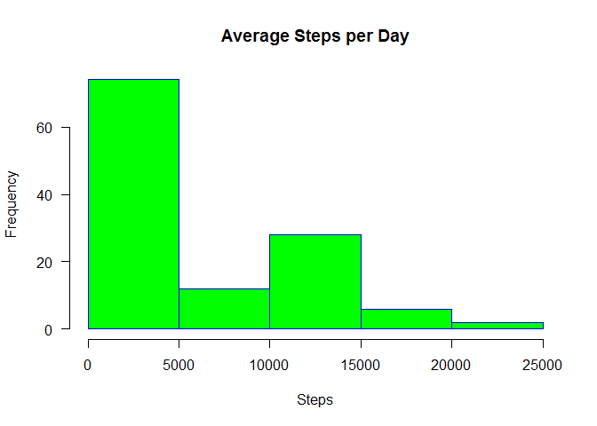
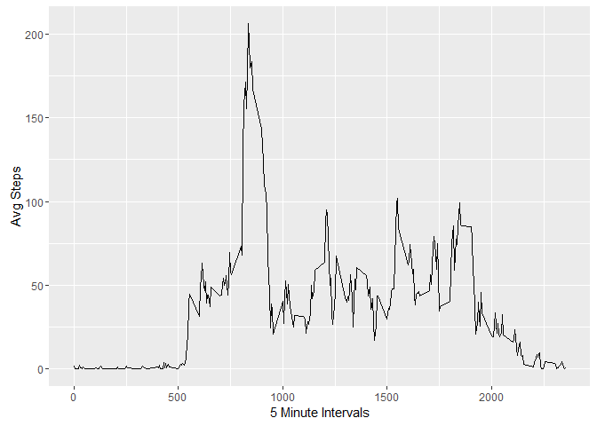
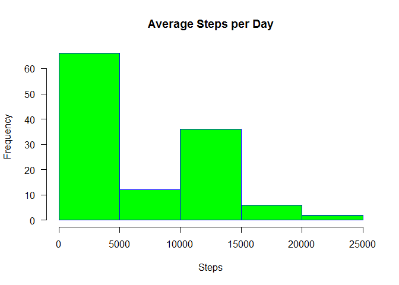
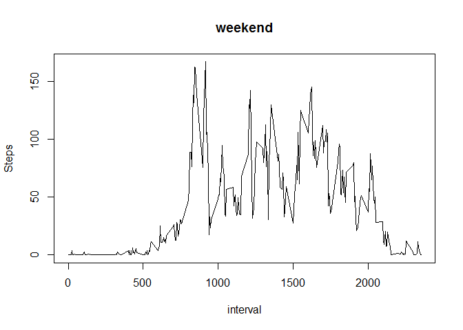
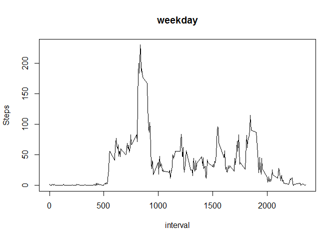

# PA1_template.Rmd
Chad Banicki  
February 3, 2016  
#Reproducible Research
##Assignment: Course Project 1

Load the packages needed for the script:


```r
    library(dplyr)
```

```
## 
## Attaching package: 'dplyr'
```

```
## The following objects are masked from 'package:stats':
## 
##     filter, lag
```

```
## The following objects are masked from 'package:base':
## 
##     intersect, setdiff, setequal, union
```

```r
    require(data.table)
```

```
## Loading required package: data.table
```

```
## 
## Attaching package: 'data.table'
```

```
## The following objects are masked from 'package:dplyr':
## 
##     between, last
```

```r
    library(ggplot2)
  
    library(grid)
  
    #setwd("C://R//RR")
```


Check to see if the data is already in the working directory, if not then retrieve and unzip:


```r
  ###################################################################################################
  #                                           Collect Data
  #####################################################################################################

tryCatch(
  
  {
    #Check whether you have already dowloaded the data into the working director, and if not, download and unzip it 
    
    message("Checking local drive for data file. If it's not there then trying URL for new file.")
    
      if (!file.exists("repdata-data-activity.zip")) {
        
        fileURL <- "https://d396qusza40orc.cloudfront.net/repdata%2Fdata%2Factivity.zip"
        
        fileName <- "repdata-data-activity.zip"
        
        download.file(fileURL, fileName, mode = "wb")
        
        dateDownloaded <- date()
        
        unzip(fileName, files = NULL, list = FALSE, overwrite = TRUE,
              junkpaths = FALSE, exdir = ".", unzip = "internal",
              setTimes = FALSE)
    }
    
  },
  error=function(cond) {
    message(paste("Error getting data:", fileURL))
    message("Original Error Message:")
    message(cond)
    # Return NA
    stop("Check connection and try again.")
    return(NA)
  },
  warning=function(cond) {
    message(paste("Warning getting data", fileURL))
    message("Original warning message:")
    message(cond)
  },
  
  finally={
    
      ## Read tracking data
    data <- read.csv("repdata-data-activity//activity.csv", header = TRUE,na.strings = c("NA"))
    
    # return(data)
  }
  )
```

```
## Checking local drive for data file. If it's not there then trying URL for new file.
```

##     What is mean total number of steps taken per day?
    
    For this part of the assignment, you can ignore the missing values in the dataset.
    
   1.  Calculate the total number of steps taken per day
   
    

```r
    dataSum <- tbl_df(data)
    
    dataSteps <- 
      dataSum %>%
      group_by(date)  %>%   
      summarize(Steps_Total=sum(steps, na.rm=TRUE))  %>% 
      select(date,Steps_Total) 
```

##   2. Make a histogram of the total number of steps taken each day
    

```r
    dailySteps <- c(dataSteps$Steps_Total, dataSteps$date)
    
    hist(dailySteps,main="Average Steps per Day",xlab="Steps",border="blue",col="green",las=1,breaks=5)
```




```r
#  3. Calculate and report the mean and median of the total number of steps taken per day
    meanSteps <- mean(dataSteps$Steps_Total)
    
    medianSteps <- median(dataSteps$Steps_Total)
```

##     What is the average daily activity pattern?
 
  1. Make a time series plot (i.e. type = "l") of the 5-minute interval (x-axis) and the average number of     steps taken, averaged across all days (y-axis) 
  
  

```r
    dataIntervalSteps <-  
      dataSum %>%
      group_by(interval)  %>%   
      summarize(Steps_Total= mean(steps, na.rm=TRUE))  %>% 
      select(interval,Steps_Total)
    
    
#     dataIntervalSteps$date <- as.Date(dataIntervalSteps$date)

    # Basic line graph
    ggplot(dataIntervalSteps, aes(x=dataIntervalSteps$interval, y=dataIntervalSteps$Steps_Total)) +
      geom_line() + xlab("5 Minute Intervals") + ylab("Avg Steps")
```


  
##   Which 5-minute interval, on average across all the days in the dataset, contains the maximum number of       steps?


```r
    MaxRow <- dataIntervalSteps[which.max(apply(dataIntervalSteps[,2],MARGIN=1,max)),]
    #      835    206.1698
```

##     Imputing missing values
        Note that there are a number of days/intervals where there are missing values (coded as NA). The presence of missing days may introduce bias into some calculations or summaries of the data.
     1.  Calculate and report the total number of missing values in the dataset (i.e. the total number of rows with NAs)
    

```r
      NAdata <- data[rowSums(is.na(data)) > 0,]
    
    #nrow(NAdata)
    # 2304
```

##   2.  Devise a strategy for filling in all of the missing values in the dataset. The strategy does not need to be sophisticated. 
    For example, you could use the mean/median for that day, or the mean for that 5-minute interval, etc.
 

```r
    #Assign the mean (by interval) steps value to the corresponding value in NAdata
    NAdata$steps <- dataIntervalSteps$Steps_Total[match(NAdata$interval, dataIntervalSteps$interval)]
    
    #Remove the NA data
    dataNew <- na.omit(data)
```

    
##   3. Create a new dataset that is equal to the original dataset but with the missing data filled in.  

```r
    dataComplete <- rbind(dataNew,NAdata)
```

##  4. Make a histogram of the total number of steps taken each day and Calculate and report the mean and median 
total number of steps taken per day. Do these values differ from the estimates from the first part of the assignment? 
What is the impact of imputing missing data on the estimates of the total daily number of steps? 


```r
    dataStepsNew <- 
      dataComplete %>%
      group_by(date)  %>%   
      summarize(Steps_Total=sum(steps, na.rm=TRUE))  %>% 
      select(date,Steps_Total) 
    
    
    dailyStepsNew <- c(dataStepsNew$Steps_Total, dataStepsNew$date)
    
    hist(dailyStepsNew,main="Average Steps per Day",xlab="Steps",border="blue",col="green",las=1,breaks=5)
```


 
##  Calculate and report the mean and median of the total number of steps taken per day


```r
    meanStepsNew <- mean(dataStepsNew$Steps_Total)
    
    medianStepsNew <- median(dataStepsNew$Steps_Total)
```
    
   
##    Are there differences in activity patterns between weekdays and weekends?
   
For this part the weekdays() function may be of some help here. Use the dataset with the filled-in missing values for this part.
    
  1.  Create a new factor variable in the dataset with two levels - "weekday" and "weekend" indicating whether a given date is a weekday or weekend day.

2.  Make a panel plot containing a time series plot (i.e. type = "l") of the 5-minute interval (x-axis) 
and the average number of steps taken, averaged across all weekday days or weekend days (y-axis). 
See the README file in the GitHub repository to see an example of what this plot should look like using simulated data.


```r
   # attach(dataComplete)
    
    
    dataComplete["DayType"] <- weekdays(as.Date(dataComplete$date)) 
    
    
    DayType.f <- factor(dataComplete$DayType)
    
    
    levels(DayType.f) <- list("weekday"= c("Monday","Tuesday","Wednesday","Thursday","Friday"), "Weekend" = c("Saturday","Sunday"))
    
    
    dataComplete["WeekType"] <- DayType.f 
    
    # Divide up the data by weekend or weekday
    
    weekenddata <- dataComplete[ which(dataComplete$WeekType=="Weekend"),]
    
    weekdata <- dataComplete[ which(dataComplete$WeekType=="weekday"),]
    
    
    weekendSummary <- 
      weekenddata %>%
      group_by(interval)  %>%   
      summarize(Steps_Total=mean(steps, na.rm=TRUE))  %>% 
      select(interval,Steps_Total) 
    
    weekSummary <- 
      weekdata %>%
      group_by(interval)  %>%   
      summarize(Steps_Total=mean(steps, na.rm=TRUE))  %>% 
      select(interval,Steps_Total) 
    

    par(mfrow=c(2,1))
    
    x11(width=4, height=6)
    
    # Basic line graph
    
    plot(weekendSummary$interval, weekendSummary$Steps_Total, type="l", main="weekend", xlab="interval",ylab="Steps") 
```



```r
    plot(weekSummary$interval, weekSummary$Steps_Total, type="l", main="weekday", xlab="interval",ylab="Steps") 
```


